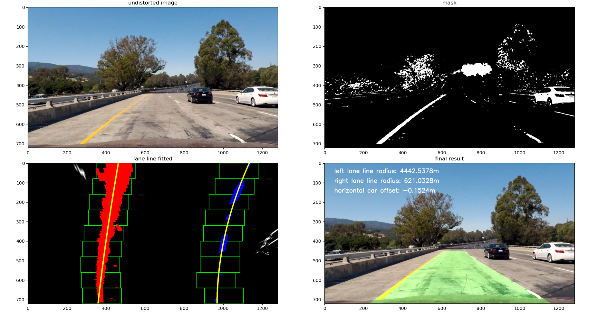

**Advanced Lane Finding Project**

The goals / steps of this project are the following:

* Compute the camera calibration matrix and distortion coefficients given a set of chessboard images.
* Apply a distortion correction to raw images.
* Use color transforms, gradients, etc., to create a thresholded binary image.
* Apply a perspective transform to rectify binary image ("birds-eye view").
* Detect lane pixels and fit to find the lane boundary.
* Determine the curvature of the lane and vehicle position with respect to center.
* Warp the detected lane boundaries back onto the original image.
* Output visual display of the lane boundaries and numerical estimation of lane curvature and vehicle position.

### Camera Calibration

#### 1. Briefly state how you computed the camera matrix and distortion coefficients. Provide an example of a distortion corrected calibration image.

- The code for camera calibration is in `src/camera_calibration.py`.
- Given several chessboard images, their corners' image coordinates `img_points` are found  and world coordinates `obj_points` are defined; then use this pair of coordinates to calculate **camera matrix** and **distort coefficients**; finally use these parameters to undistort images taken by the same camera. 

### Pipeline (single images)

#### 1. Provide an example of a distortion-corrected image.

- Undistort road images taken from the same camera as above: 

#### 2. Describe how (and identify where in your code) you used color transforms, gradients or other methods to create a thresholded binary image.  Provide an example of a binary image result.

- the code is in `threshold()` function in `src/pipeline.py` (line 45~62).
- I transferred BGR image to HLS color space and use two HLS channel range to find yellow and white pixels. I referred to this blog https://naokishibuya.medium.com/finding-lane-lines-on-the-road-30cf016a1165.
- The results (including (a) undistorted original image, (b) thresholded binary image, (c) perspective transformed binary image with fitted polynomial plotted, and (d) final image with ego lane warped back and radius, car offset displayed) are in [Pipeline results for test images](#pipeline-results-for-test-images) part.

#### 3. Describe how (and identify where in your code) you performed a perspective transform and provide an example of a transformed image.

- the perspective transform code includes `warp_img()` and `warp_img_back()` functions in `pipeline.py` (line 64~72).

- the source and destination points I used are:

|  Source   | Destination |
| :-------: | :---------: |
| 197, 720  |  340, 720   |
| 592, 450  |   340, 0    |
| 688, 450  |   940, 0    |
| 1118, 720 |  940, 720   |

- the result is like this: 

#### 4. Describe how (and identify where in your code) you identified lane-line pixels and fit their positions with a polynomial?

- The code includes `find_lane_pixels_sliding_window()` (line 74~158, to take lane pixels), `fit_polynomial()` (line 160~180) and `find_lane_pixels_around_poly()` (line 196~224, to collect lane pixels around the fitted polynomial).
- I use sliding window method to cluster left and right lane line pixels and fit a polynomial on them. 
- From the second frame, pixels around the lane line polynomial from last frame are collected and fitted to polynomial again.
  - Because this can deal with the project video right now, I have not implement the lane line tracking and sanity check.
- The results are in [Pipeline results for test images](#pipeline-results-for-test-images) part.

#### 5. Describe how (and identify where in your code) you calculated the radius of curvature of the lane and the position of the vehicle with respect to center.

- The code is `measure_curvature_real()` (line 272~296) in `pipeline.py`. Polynomial pixels are converted to meters and radius is calculated as follows (`left_fit_cr, right_fit_cr` are polynomial coefficients in meter unit.): 

  ```python
  left_curverad = (1 + (2 * left_fit_cr[0] * y_eval + left_fit_cr[1]) ** 2) ** (3 / 2) / abs(
              2 * left_fit_cr[0])
  right_curverad = (1 + (2 * right_fit_cr[0] * y_eval + right_fit_cr[1]) ** 2) ** (3 / 2) / abs(
              2 * right_fit_cr[0])
  ```

- the position of the vehicle with respect to center is calculated as the difference between the image bottom center and average position of left and right lane line's start points, which is then converted to meter unit.

#### 6. Provide an example image of your result plotted back down onto the road such that the lane area is identified clearly.

- the final results are shown as follows.

---

### Pipeline results for test images

- results for `test1.jpg`

 

- results for `test2.jpg`


- results for `test3.jpg`


- results for `test4.jpg`


- results for `test5.jpg`


- results for `test6.jpg`


### Pipeline (video)

#### 1. Provide a link to your final video output.  Your pipeline should perform reasonably well on the entire project video (wobbly lines are ok but no catastrophic failures that would cause the car to drive off the road!).

- The final video output is [here](output_images/project_video.mp4).

---

### Discussion

#### 1. problems / issues I faced in implementation.  

- The biggest problem that I faced is the threshold binary image. Although the yellow and white mask worked here, actually it failed on challenge video.

#### 2. Where will the pipeline likely fail?  

- When applied to image with big shadow (for example, under a bridge), white pixel will be hardly detected, because white pixel is taken based on lightness only.

#### 3. to make it more robust?

- I am going to do lane line tracking and sanity check. Right now, since current pipeline can deal with the project video, I skipped them here.